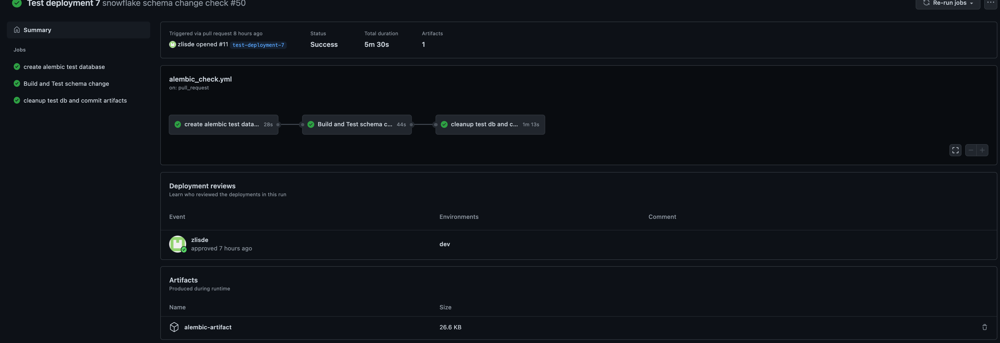

# Snowflake alembic 

We use [alembic](https://alembic.sqlalchemy.org/en/latest/tutorial.html) with SQLAlchemy as the underlying engine to 
manage table schema changes in snowflake databases. We will use same alembic .ini to manage separate alembic 
environments, and each database schema has its own alembic environment to manage table schemas change within it,  and 
the alembic version tables that alembic uses to track changes in each database schema will be located in `curlogy.utility`
schema with naming convention as "{schema_name}_alembic_version".


### Structure of Snowflake Migration Folder
- Folder [models](models) contains expected table definitions organized by 
  schema as sub folder. When we run `alembic --name $schema_name revision --autogenerate` against the schema, alembic 
  will compare the table definitions with current table schema in database, and auto-generate revision files. 
  
- Folder [migrations](migrations) contains revision files for schema 
  change generated from alembic autogenerate feature,  when command `alembic --name $schema_name upgrade head` executed,
  the actual change will apply to target database. 

- Folder [utils](utils) contains a helper script to help create test 
  database by cloning target database.
  
- Folder [templates](templates) contains template folder for new schemas.
 
- File [alembic.ini](alembic.ini) is the alembic configuration file.

### GitHub Workflow
There are two GitHub workflows that help us to test the change in test database and deploy
the change in production database:

 - [alembic_check.yml](../.github/workflows/alembic_check.yml), this workflow will be triggered when Pull-request is 
   created and files changed in directory [models](models), 
   and this alembic check workflow will accomplish following (assuming preceding step run successfully) :
   
   1. Create test database named `alembic_test_db` which is a clone of target database (in our case: `curlogy`)
   2. Find all the changed files within folder [models](models) for each 
      schema, and collect all the unique schema names (subfolder name) with table definition files changed.
   3. Run the command `alembic --name $schema_name revision --autogenerate` for each schema in step 2, then revision 
      files will be generated and placed in corresponding schema folders within folder 
      [migrations](migrations).
   4. Run the command `alembic --name $schema_name upgrade head` for each schema identified in step 2 with revision 
      files generated in step 3, and apply the change in test database created in step 1.
   5. Upload the revision files generated in step 3 to GitHub artifact.
   6. **Since GitHub manual approval is not available for our private repo, auto-commit of artifacts is disabled in
      this workflow. If steps 1 through 5 run successfully, and the change in test database meet the expectations
      we will need to download artifact from step 5(migrations folder with new revision files)
      and replace `migrations` folder in current feature branch, and commit the change. (artifact
      can be found at the bottom of each successful alembic_check workflow run.** )
    
        
 - [alembic_deploy.yml](../.github/workflows/alembic_deploy.yml), this workflow will be triggered when merging the PR 
   and files changed in directory (snowflake_migration/migrations).
   1. Drop test database created in workflow `alembic_check.yml`.
   2. Apply the revision files change to production database.
    
### GitHub Secrets

We need to set up a few GitHub secrets for the pipeline to use to communicate with snowflake:

`ALEMBIC_TEST_DB`: this is the test database name for schema change, value: alembic_test_db.

`SNOWFLAKE_URL`: snowflake SQLAlchemy connection string to compare schema and apply changes, 
please use user `svc_lattice`,  so make sure all the tables and objects are under same owner

`SNOWFLAKE_ALEMBIC_ROLE`: the role we use for alembic action,  use `svc_lattice` ETL role.

`SNOWFLAKE_ADMIN_URL`: snowflake SQLAlchemy connection string to create test database,  
please use user `sf_terraform`.

`SNOWFLAKE_CUROLOGY_DATABASE`: target curology production database, value: curology.


# HOWTO

1. How to add a new schema alembic folders? 
    
    There are 4 steps involved when adding tables in new schema:
   
   1. Copy the template folder [templates/migrations/schema_name](templates/migrations/schema_name)
   into [migrations](migrations) and rename the template folder name from "schema_name"
      to the actual new schema name.
      
   2. Then change schema name for row 30 and 31 in `env.py.tpl` to new schema name, and remove `.tpl` from file name.
   ```python
   from snowflake_migrations.models.{schema_name}.base import Base
   from snowflake_migrations.models import {schema_name}
   ```
   
   3. Then we need to add a new configuration session in file [alembic.ini](alembic.ini),
   and replace `schema_name` with new schema name.
   ```editorconfig
   [schema_name]
   script_location = migrations/schema_name
   file_template = %%(slug)s%%(year)d%%(month).2d%%(day).2d%%(hour).2d%%(minute).2d%%(second).2d_%%(rev)s
   ```
   
   4. Copy the template folder [templates/models/schema_name](templates/models/schema_name)
   into [models](models) and rename the template folder name from "schema_name"
      to the actual new schema name.
      

2. How to add a new table model?
   
   For each table,  we use a column MixIn to help us to define common columns, and we use this mixin 
   class to define `row_id` which is autoincrement and serve as a fake primary key, `_lattice_exec_date_utc` 
   and ` _snowflake_synced_utc` are columns to store airflow execution date and row update date.
   ```python
   class AuditColumnMixin:
       @declared_attr
       def __tablename__(cls):
           return cls.__name__.lower()

       row_id = sa.Column(sa.types.BIGINT, autoincrement=True, primary_key=True)
       _lattice_exec_date_utc = sa.Column(sa.types.TIMESTAMP)
       _snowflake_synced_utc = sa.Column(sa.types.TIMESTAMP)
   ```
   Adding a new table model script is easy,  we just go to the right database schema folder in [models](models)
   and add a python file with SQLalchemy ORM model defined, once table is defined,  we need import the table model class inside `__init__.py` file 
   with in each data schema folder,  so these models can be loaded into memory in the `env.py` file for alembic to compare.
   for example: table model for `dm_datascience.user_ltv`. 
   ```python
   import sqlalchemy as sa
   from snowflake_migrations.models.base import AuditColumnMixin
   from snowflake_migrations.models.dm_datascience.base import Base # import the ORM base for all tables in this schema
   
   class UserLtv(AuditColumnMixin, Base):  # AuditColumnMixin will preprend 3 columns at beginning of each table: row_id, _lattice_exec_date_utc, _snowflake_synced_utc
                                           # row_id is autoincrement and serve as a fake primary key.
       __tablename__ = "user_ltv"          # define table name 
       __table_args__ = {"schema": "dm_datascience", "extend_existing": True} # define schema name
        
        # below are the column and column defintions
       user_id = sa.Column(sa.types.BIGINT)
       consultation_completed_date = sa.Column(sa.types.DATE)
       consultation_completed_month = sa.Column(sa.types.DATE)
       channel = sa.Column(sa.types.TEXT)
       demo = sa.Column(sa.types.TEXT)
       signup_plan = sa.Column(sa.types.TEXT)
       formula_group = sa.Column(sa.types.TEXT)
       predicted_revenue = sa.Column(sa.types.FLOAT)
       predicted_gp = sa.Column(sa.types.FLOAT)
   ```
   
   `models/dm_data_science/__init__.py` file:
   ```python
   from snowflake_migrations.models.dm_datascience.user_ltv import UserLtv

   __all__ = ["UserLtv"]
   ``` 

   Column data type choices: 
   
   BIGINT: since there is no storage and performance impact in snowflake for integer value, use `BIGINT` for integer
value in general. 
   
   VARCHAR: There is also no storage and performance impact, use `TEXT` which is synonymous with varchar with default
length of 16,777,216
   
   FLOAT: Floating point operations can have small rounding errors,
   especially when the operands have different precision or scale. Errors can accumulate, 
   especially when aggregate functions (e.g. SUM() or AVG()) process large numbers of rows. Errors can vary each time the query is executed if the rows are processed in a different order (e.g. if partitioned differently across a distributed system). 
   Casting to a fixed-point data type before aggregating can reduce or eliminate these errors, or we can use snowflake
   fixed-point data type `NUMBER`,  but `NUMBER` type has less exponents and the number of digits after decimal impact
   storage and performance.
   

3. How to add/remove a column?
   
   Simply add or remove a column in the table model file.
  
 
4. How to change a column name? 
   
   Since alembic does not detect column name changes, there are manual steps involved:
    
   1. Adding a column with new name, make the PR and apply the change in production. 
   2. Manually update table to set column value of new name to be equal to old name
   3. Drop the old name column, and make the PR and apply change.

5. How to change a column type? 
 
   1. Adding a column with new data type with `_temp` suffix in the column name, 
      make the PR and apply the change in production.
   2. Manually update table to set the value of this column by casting the old column type into this new data type 
   3. Drop the old name column, and make the PR and apply change. Then following 'how to change a column name' to change 
   the column name back.
   
# Q&A

Why do we have `base` models for each schema but not one centralized `base`? 

Alembic load base metadata into memory with table definitions to compare table changes, separate base model 
give us isolated alembic environment and prevent each base model confuses each other. 